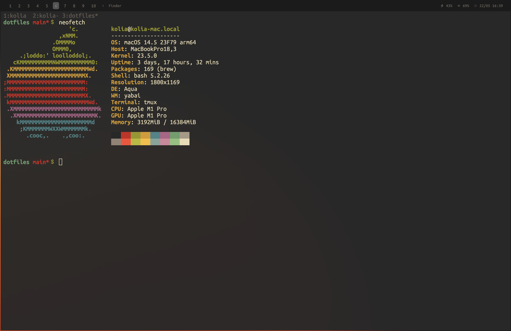

# dotfiles



## setup

- window manager: aerospace+sketchybar
- terminal: ghostty
- editor: neovim + lazy
- shell: bash
- prompt: starship
- terminal multiplexer: herdr
- git: lazygit
- browser: Search
- theme: gruvbox dark
- ai: pi, opencode

## dot CLI

This repo ships with a `dot` CLI (a single bash script, `./dot`) that automates
setup, updates, diagnostics and package management. It is wired into
`~/.bashrc` as a function: `dot` without arguments cd's into the repo,
`dot <command>` runs the CLI.

| Command                                         | What it does                                                   |
| ----------------------------------------------- | -------------------------------------------------------------- |
| `dot doctor`                                    | Diagnostics: brew, stow, bash, symlinks, SSH key, dev tools    |
| `dot stow`                                      | Re-apply `home/` symlinks via GNU Stow                         |
| `dot init`                                      | Full setup: Homebrew, `packages/bundle`, stow, bun/pi, SSH key |
| `dot update`                                    | git pull → brew update/upgrade → re-stow → pi update           |
| `dot package add <n> [brew\|cask] [base\|work]` | Install + add to Brewfile                                      |
| `dot package list` / `dot check-packages`       | Show bundles / installed vs missing                            |
| `dot retry-failed`                              | Retry failed installs from `packages/failed_packages_*.txt`    |
| `dot gen-ssh-key [email]`                       | ed25519 key, add to ssh-agent, copy pub key                    |
| `dot benchmark-shell`                           | Measure interactive bash startup time                          |
| `dot completions`                               | Generate bash completions (`completions/dot.bash`)             |
| `dot link` / `dot unlink`                       | Global `dot` symlink in `~/.local/bin`                         |
| `dot edit`                                      | Open the repo in `$EDITOR`                                     |

Run `./dot help` for the full reference.

> `init`, `update`, `package add/remove/update`, `gen-ssh-key`, `link`, `stow`
> change your system or `$HOME`. For read-only checks use `dot doctor`,
> `dot check-packages`, `dot package list`.

## Stow quick start

This repo uses GNU Stow with the `home/` directory as a mirror of your real `$HOME`.

### 1) Install GNU Stow

```bash
brew install stow
```

### 2) Apply dotfiles symlinks

```bash
stow -R -v -d "$HOME/repos/dotfiles" -t "$HOME" home
```

### 3) Re-apply after changes

Run the same command after any edits in this repo:

```bash
stow -R -v -d "$HOME/repos/dotfiles" -t "$HOME" home
```

### 4) Remove symlinks created by stow

```bash
stow -D -v -d "$HOME/repos/dotfiles" -t "$HOME" home
```

### 5) Important rule

Edit files in this repo (`home/...`), not directly in `~/.config` or `~/.*`.

If you edit symlink targets directly outside repo, your changes can drift from version control.

## Private/local files (not in git)

Keep sensitive or work-specific data outside this repo:

- `~/.bashrc.local` (tokens, internal aliases, AWS profiles)
- `~/.gitconfig.local` (name/email)
- `~/.config/opencode/agents/*.private.md` (private policies)
- `~/.pi/agent/AGENTS.md` (local agent guidance)

Load local bash settings from `~/.bashrc` with:

```bash
[[ -f ~/.bashrc.local ]] && source ~/.bashrc.local
```

## Before publishing

Run this check before commit/push:

```bash
git add -A
git diff --cached | rg -i "token|secret|password|awsapps|atlassian.net|corp|internal"
```

If output is not empty, remove or move those lines/files before publishing.
