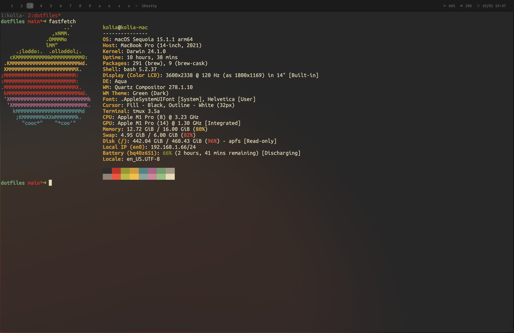

# dotfiles

## setup

* window manager: yabai + skhd
* terminal: alacritty/kitty
* editor: neovim + lazy
* shell: bash
* prompt: starship
* terminal multiplexer: tmux/kitty
* git: lazygit
* browser: Arc
* theme: gruvbox dark
